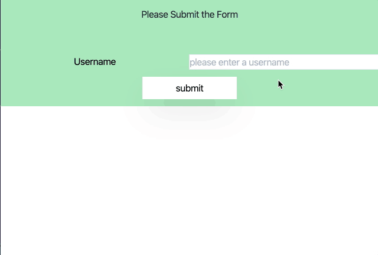

# playwright-react-typescript-jest-example
a [react](https://github.com/facebook/react) + [typescript](https://github.com/microsoft/TypeScript) + [tailwindcss](https://github.com/tailwindcss/tailwindcss) application that uses [jest](https://github.com/facebook/jest) + [playwright](https://github.com/microsoft/playwright).

This repo is a POC on how to introduce [playwright](https://github.com/microsoft/playwright) into an application to meet E2E testing needs.

---
Table of contents:
* [problem](#problem)
* [why](#why)
* [running the example](#running-the-example)
* [solution](#solution)
* [future](#future)
---

### [problem](#problem)
It is common for many projects to use [Cypress](https://github.com/cypress-io/cypress) for writing E2E tests in order to cover all functionality for users.

What are E2E tests?

> Typically these will run the entire application (both frontend and backend) and your test will interact with the app just like a typical user would
>
> [Kent C Dodds - Static vs Unit vs Integration vs E2E Testing for Frontend Apps](https://kentcdodds.com/blog/unit-vs-integration-vs-e2e-tests)

While Cypress has recently started to include [multi-browser support](https://www.cypress.io/blog/2020/02/06/introducing-firefox-and-edge-support-in-cypress-4-0/), there's still an issue of veryifying scenarios across browsers such as webkit for Apple products.

We need a way to easily verify and test behaviors across browsers. If we have a user scenario that fails for on iOS devices, we need to be able to write a regression test for it.

---

### [why](#why)
[playwright](https://github.com/microsoft/playwright) offers testing capabilities across multiple browsers and environments. Unlike Selenium Webdriver, [playwright](https://github.com/microsoft/playwright) has an easier to grok API that allows for a better developer experience.

---

### [running the example](#running-the-example)
Once finish cloning run the following command, in the project directory, to install the project dependencies:
```
npm i
```

After installing the dependencies, start the application with the following command:
```
npm start
```

Here is what the application looks like running:



A form component with basic validation.

Open another tab or window in your terminal and navigate back to the project directory, run the tests with the following command:
```
npm run test
```

The output should look like the following:
```
insert jest results here
```


---

### [solution](#solution)
#### ([I won't give up on you](https://www.youtube.com/watch?v=Dp9FfwrbJSg#t=2m13s))


---

### [future](#future)
Will include more elaborate actions to showcase how to use the [playwright](https://github.com/microsoft/playwright).

May include examples of how integrate with screenshot capabilities with libraries to do image testing with [pixelmatch](https://github.com/mapbox/pixelmatch).
