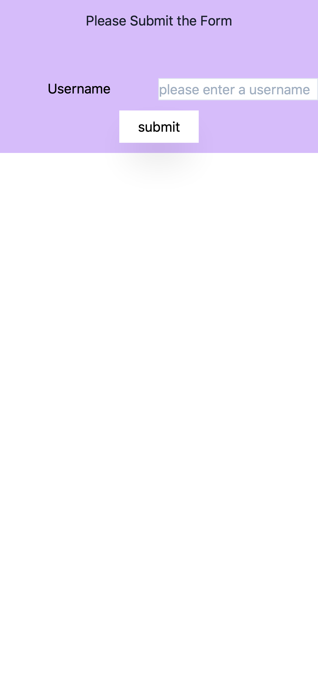
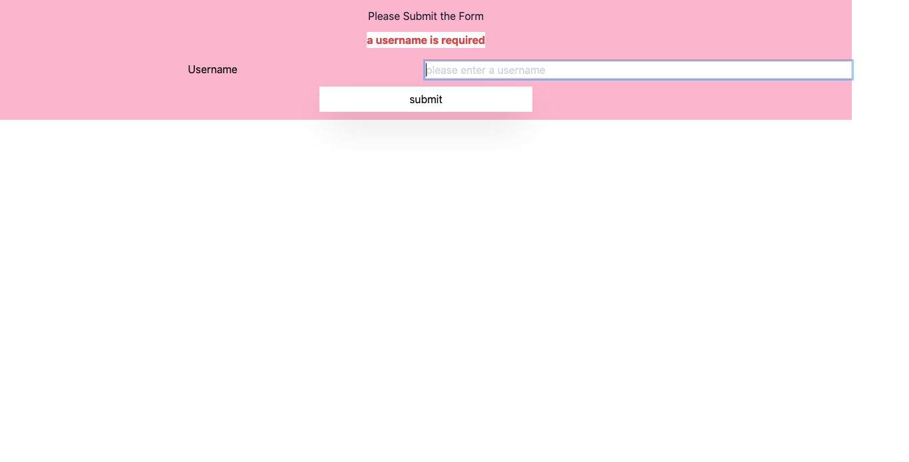

# playwright-react-typescript-jest-example
a [react](https://github.com/facebook/react) + [typescript](https://github.com/microsoft/TypeScript) + [tailwindcss](https://github.com/tailwindcss/tailwindcss) application that uses [jest](https://github.com/facebook/jest) + [playwright](https://github.com/microsoft/playwright).

This repo is a POC on how to introduce [playwright](https://github.com/microsoft/playwright) into an application to meet E2E testing needs.

---
Table of contents:
* [problem](#problem)
* [why](#why)
* [running the example](#running-the-example)
* [solution](#solution)
* [future](#future)
---

### [problem](#problem)
It is common for many projects to use [Cypress](https://github.com/cypress-io/cypress) for writing E2E tests in order to cover all functionality for users.

What are E2E tests?

> Typically these will run the entire application (both frontend and backend) and your test will interact with the app just like a typical user would
>
> [Kent C Dodds - Static vs Unit vs Integration vs E2E Testing for Frontend Apps](https://kentcdodds.com/blog/unit-vs-integration-vs-e2e-tests)

While Cypress has recently started to include [multi-browser support](https://www.cypress.io/blog/2020/02/06/introducing-firefox-and-edge-support-in-cypress-4-0/), there's still an issue of veryifying scenarios across browser engines such as webkit for Apple products.

We need a way to easily verify and test behaviors across browsers. If we have a user scenario that fails for on iOS devices, we need to be able to write a regression test for it.

---

### [why](#why)
[playwright](https://github.com/microsoft/playwright) offers testing capabilities across multiple browsers and environments. Unlike Selenium Webdriver, [playwright](https://github.com/microsoft/playwright) has an easier to grok API that allows for a better developer experience.

---

### [running the example](#running-the-example)
After cloning this repo run the following command, in the project directory, to install the project dependencies:
```
npm i
```

After installing the dependencies, start the application with the following command:
```
npm start
```

Here is what the application looks like running:


A form component with basic validation.

**Note:** we are using [tailwindcss media queries](https://tailwindcss.com/docs/background-color/#responsive) to change the background color of the `<section>` element, as demonstrated below:
```html
 <! –– showing only relevant classnames ––>
<section className="bg-purple-300 sm:bg-green-300 md:bg-blue-300 lg:bg-pink-300 flex pb-3">
  ...
</section
```

This allows us to see different backgrounds based on viewport size, something we can declare in our tests with playwright.

**Running the tests**

In a new tab inside your terminal, run the tests with the following command:
```
npm run test
```

The output should look like the following:
```
> playwright-react-typescript-jest-example@1.0.0 test /playwright-react-typescript-jest-example
> jest

 PASS  e2e/iphone.spec.ts
 PASS  e2e/smoke.spec.ts (7.213s)
 PASS  e2e/form-success.spec.ts (8.548s)
 PASS  e2e/form-error.spec.ts (8.548s)

Test Suites: 4 passed, 4 total
Tests:       4 passed, 4 total
Snapshots:   0 total
Time:        9.941s
Ran all test suites.
```

You can additionally find screenhots taken of each test in the `e2e/screenshots/` directory.

The command `npm run purge:ss` will remove all `PNG` images from the screenshots directory, additionally the command `npm run test:clean` will remove all images then run the tests again.


---

### [solution](#solution)
#### ([I won't give up on you](https://www.youtube.com/watch?v=Dp9FfwrbJSg#t=2m13s))

**Actions**

Most assertions have their selectors defined as the following:
```js
const label = await page.$eval("css=label", el => el.textContent);
...
expect(label).toEqual("Username");
```
This allows us to predefine DOM elements we want to assert against whether in the test file itself or as page objects.

However if content is not static and the DOM changes based on user interaction or API requests we need to make sure our selectors are ansynchronous, you can see an example of this in the test file `e2e/form-success.spec.ts`:
```js
expect(await page.$eval("css=h1", el => el.textContent)).toEqual('Thank you for Submitting');
```

We can also determine what devices and browsers we want to test, as noted in the `e2e/iphone.spec.ts` file:
```js
const { webkit, devices } = require("playwright");
const iPhone11 = devices["iPhone 11 Pro"];
// skipping contents of file
const browser = await webkit.launch();
const context = await browser.newContext({
  viewport: iPhone11.viewport,
  userAgent: iPhone11.userAgent
});
```

Now we have a proper environment to write tests for an iPhone using the webkit browser engine.

The following is the screenshots of the `e2e/iphone.spec.ts` test:



Now compare the above to the firefox run of the `e2e/form-error.spec.ts` test:



Note the purple versus pink background colors. Depending on the devices we assert against, our app is able to display different colors for our responsive design choices.

playwright can allow us to see the visual inconsistencies between styles on environments and responsive devices.

---

### [future](#future)
Will include more elaborate actions to showcase how to use the [playwright](https://github.com/microsoft/playwright) API.

May include examples of how integrate screenshot capabilities with libraries to do image testing with [pixelmatch](https://github.com/mapbox/pixelmatch).
